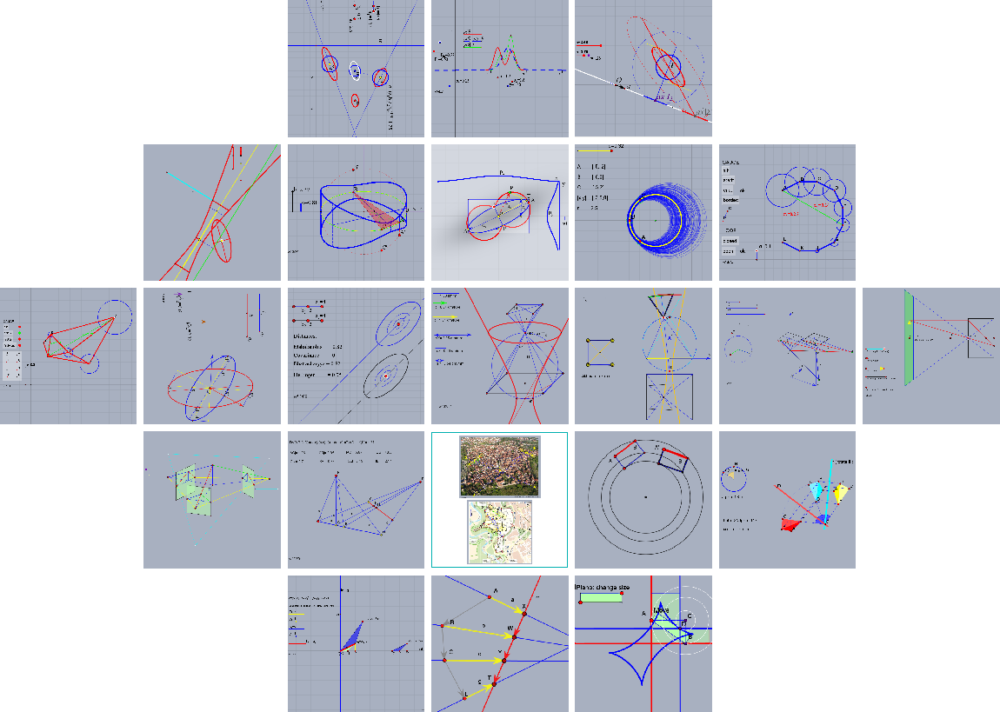

# Cinderella Animations



This repository contains the paper on Cinderella Animations together with the code and html-files for  local usage.

The interactive graphics illustrate various topicss from geometry, statistics, and estimaton theory and may be useful for supporting lectures or exploring the topics. The animations are generated with the software [Cinderella](https://www.cinderella.de/tiki-index.php).

# Content

The repository contains the main-pdf `Cinderella-Animations-local-pdf`. On its first page is has links to the files in the folder `/Cinderella` and to further explanations. 

The folder `/Cinderella` contains
* the source code of each animation, namely cdy-files, 
* the derived html-file,
* a text file describing the animation, and 
* the html-file containing the description and the animation.


# Running the animations

* clone this repository: Then you have the file Cinderella-Animations-local.pdf and the directory /Cinderella in the same folder

* open the pdf and use the provided links, or

* directly run the html-files.

# Requirements

Some explanations in `Cinderella-Animations-local-pdf` refer to the [Collected Notes](https://www.ipb.uni-bonn.de/html/staff/WolfgangFoerstner/collectednotes_v2/main-Lecturenotes.pdf), which requires you are online.

# Licence

You may use and modify all files. Especially, you may call the *.cdy-files using the [Cinderella software](https://beta.cinderella.de/) and adapt the geometric constructions or the scripts according to your needs. You may translate or modify the accompanying text. When presenting or publishing modifications, please, use the citation below.


# Citation

When presenting or publishing modifications, please, refer to the followng document:

```
@Report{foerstner2024cinderella,
author = {Wolfgang F{\"{o}}rstner},
date = {2024},
institution = {{Institute for Geodesy and Geoinformation, StachnissLab}},
title = {{Cinderella Animations}},
type = {techreport},
url = {https://www.ipb.uni-bonn.de/html/staff/WolfgangFoerstner/collectednotes_v2/Cinderella-Animations.pdf},
year = {2024},
}

```

# License
Copyright 2024, Wolfgang Förstner, Cyrill Stachniss, Photogrammetry and Robotics Lab, University of Bonn.

This project contains free software made available under the MIT License. For details see the LICENSE file.
